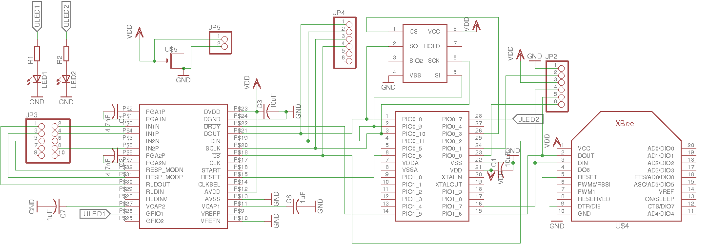
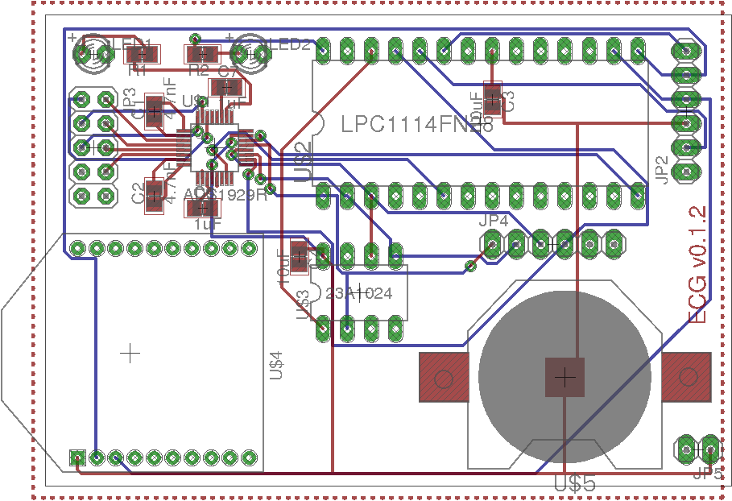

# ECG PCB

## Notes

JP2 is UART, used for issuing commands, downloading data and upgrading firmware. Firmware updates require the MCU to enter bootloader mode at startup using the DTR, RTS lines (connect DTR to RESET and RTS to ISPEnter pin). Note that connecting to the device with picocom while DTR connected will cause the device to reset on connect. Disconnect RESET line during normal use.

Pin 1 = GND, pin 2 = ISPEnter, pin 3 = Vdd, pin 4 = TXD, pin 5 = RXD, pin 6 = RESET.  

JP4 is a convenient point to access the SPI bus from MCU to ECG front end IC. Pin 1 = DOUT, pin 2 = DIN, pin 3 = SCLK, pin 4 CS. Pin 5, 6 was NC 
on the PCB but on prototype bodge wire was used to connect VCC and GND. 

JP3 analog ECG lines. Pin 1 = RLDOUT, pin 2 = IN1N, pin 3 = IN1P.

JP5 power.

## Bugs

There were some bugs on the board:

1. ADS1929R missing crucial feedback from RLDOUT via 1Mohm resistor with 1.5nF capacitor in parallel with resistor.
Ref datasheet figure 52. Not clear if this bug could have been worked around in software.

2. CLKSEL needs to be tied high to enable internal clock.

3. Coin cell solder mask wrong.

4. It was a mistake not to break out a Serial Wire Debug header.

## Firmware

Firmware is available at this repository. NB: on the ads1292r-with-sram branch: *not* master branch.

https://github.com/jdesbonnet/LPC1114_ECG_firmware

